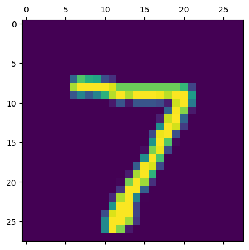
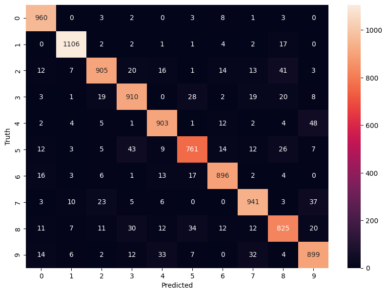

# Digit Classification Model

This project implements a basic digit classification model using the MNIST dataset, a standard benchmark dataset for image classification tasks. The model is designed to classify grayscale 28x28 images of handwritten digits (0-9) into their respective categories.


## Features
- **Dataset**: The model uses the MNIST dataset with 60,000 training images and 10,000 test images.
- **Preprocessing**: Input images are flattened and normalized for efficient computation.
- **Model Architecture**: The model consists of Dense layers with `relu` and `sigmoid` activations.
- **Evaluation Metrics**: The model's performance is measured using accuracy and loss on the test set.
- **Visualization**: Confusion matrix heatmaps are used to visualize model predictions.

## Installation and Usage

### Install Dependencies
Ensure you have Python installed along with the following libraries:
- `tensorflow`
- `numpy`
- `matplotlib`
- `seaborn`

You can install the dependencies using:
```bash
pip install tensorflow numpy matplotlib seaborn
```


## Model Improvements

### Initial Model
- **Architecture**: Single dense layer with sigmoid activation.
- **Accuracy**: Achieved ~80% accuracy on the test dataset.

### Improved Model
- **Changes**: Added a hidden layer with 100 neurons and `relu` activation.
- **Training**: Increased epochs to 5 for better convergence.
- **Accuracy**: Improved to ~91% on the test dataset.

### Final Model
- **Enhancements**: Used a `Flatten` layer for input reshaping and additional hidden layers.
- **Training**: Trained for 10 epochs, further stabilizing accuracy and reducing loss.
- **Accuracy**: Achieved ~92.4% on the test dataset, with a loss of 0.2623.

## Results
- **Training Progress**: Over 10 epochs, the loss decreased from 1.1964 to 0.2692, and accuracy improved from 71.0% to 92.4%.
- **Test Evaluation**: The final model achieved 92.4% accuracy with a test loss of 0.2623.

## Visualization
The confusion matrix heatmap provides insights into the model's predictions, highlighting areas of improvement for specific digit classifications.


## Conclusion
The digit classification model demonstrates a systematic improvement in accuracy with architectural enhancements and training refinements. It serves as a foundational project for understanding image classification using neural networks.

